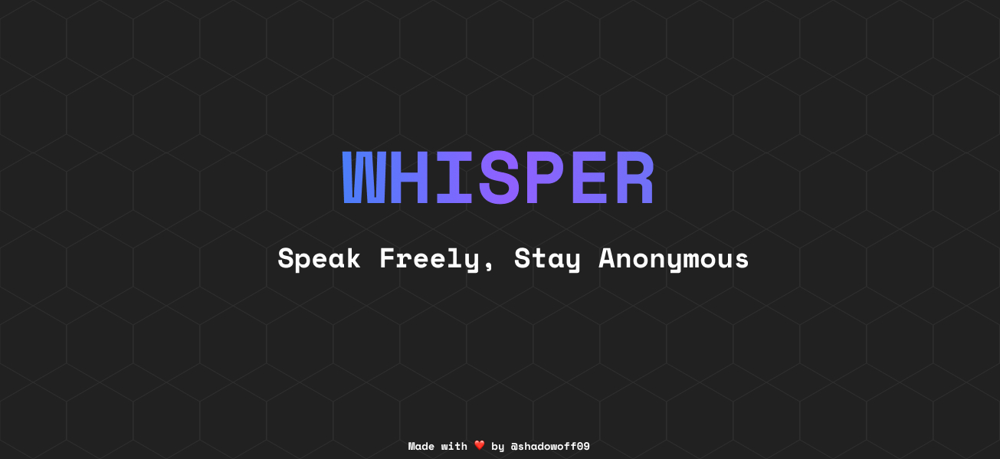

## Setting Up

To be able to run this app you NEED to do this steps:

<details><summary>Install Dependencies</summary>
<p>
Run the following console command in the root directory:

  ```bash
npm install
```

</p>
</details>

<details><summary>Setup Pocketbase</summary>
<p>
	
  > Download your prefered binary from the [Pocketbase Documentation](https://pocketbase.io/docs/)
  > 
  Once you've downloaded and extracted the archive, you could start the application by running the following console command in the extracted directory:
  ```bash
  ./pocketbase serve
  ```
> Pocketbase will give you an link like this `http://127.0.0.1:8090`
> 

<br/>

Create a `.env` file in with root directory with this inside:
```bash
POCKETBASE_URL = <your-url>
```
> Replace `<your-url>` with the Pocketbase given url.
<br/>


Download this file [pb_schema.json](pb_schema.json).

Import the downloaded file in pocketbase on `Settings -> Import collections` and `Load from JSON file`.
</p>
</details>


## Developing

Once you've completed the steps above, you can start a development server:

```bash
npm run dev

# or start the server and expose it to the network
npm run dev -- --host
```

